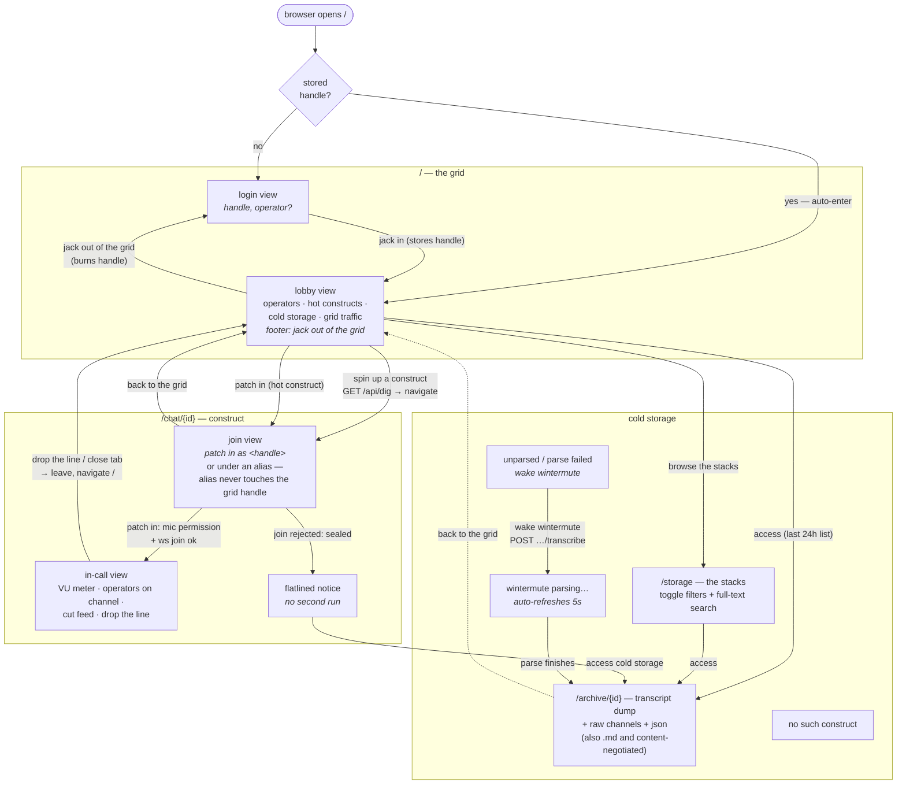
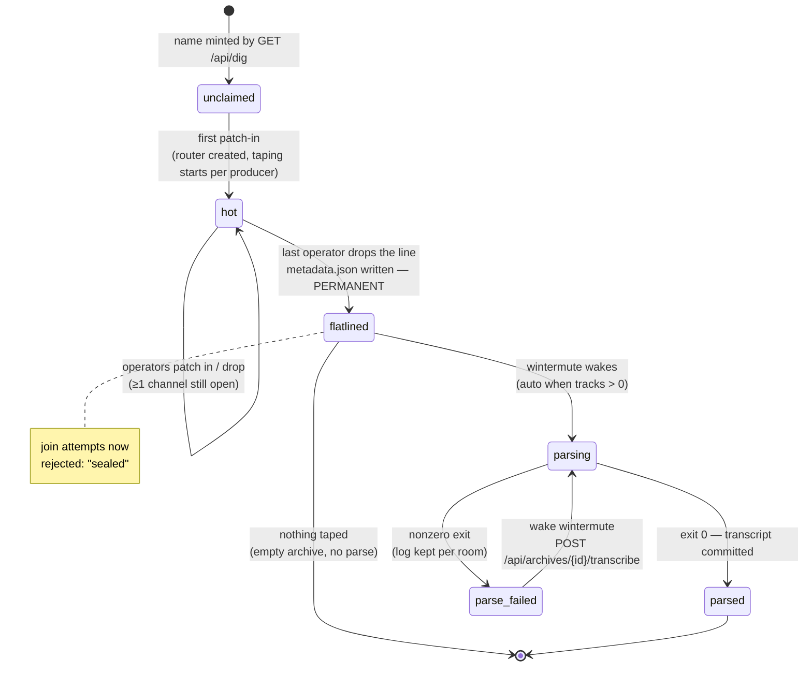
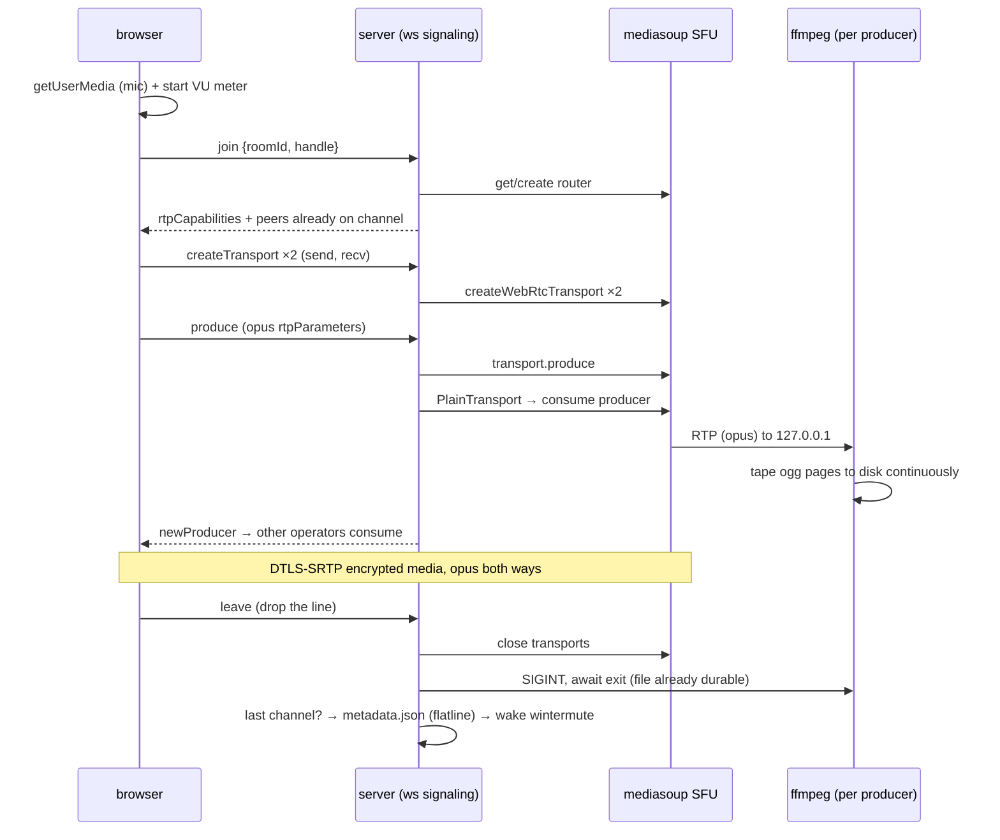

# overheard — pages, views & states

Three maps of the same city: where a browser can stand (pages and their
views), what a construct can become (its one-way lifecycle), and what
happens on the wire when an operator jacks in.

## Page & view navigation

## Construct lifecycle — one way, no second run

`metadata.json` on disk is what makes a flatline permanent: the id can
never be joined or reused.

## Jack in — what happens on the wire

The recording pipeline is fully independent of the call: an ffmpeg failure
can never drop the channel.

Source of truth: `web/src/pages/*.astro` (views), `server/index.ts`
(routing & seal), `server/recorder.ts` (taping), `server/transcriber.ts`
(wintermute).
